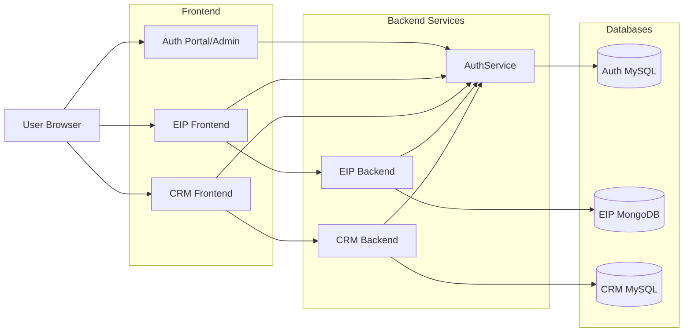
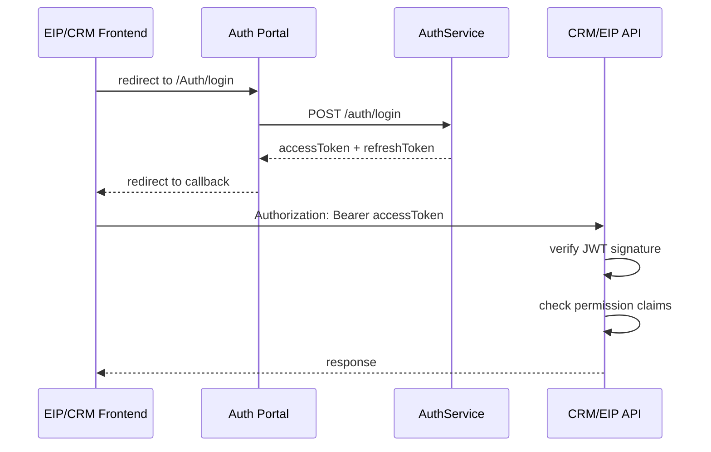

# CRM + AuthService 系統設計 SD

| 項目 | 內容 |
|---|---|
| 文件目的 | 定義 AuthService、CRM、EIP 過渡的技術設計 |
| 建議技術 | Vue 3、Tailwind、Nuxt UI、NestJS、Prisma、MySQL |
| 設計策略 | AuthService 先模組化獨立，EIP 分階段遷移 |
| 文件狀態 | 初版討論稿，2026-07-02 補實作狀態 |
| 進度交接 | `docs/operations/YSTRAVEL_AUTH_CRM_PROGRESS.md.docx` |

---

## 0. Repo 命名

新專案統一使用 `Ystravel` 前綴：

| Repo | 用途 |
|---|---|
| `Ystravel-AuthService` | NestJS AuthService API |
| `Ystravel-AuthPortal` | Vue 3 Auth Portal / Auth Admin |
| `Ystravel-CRM-Frontend` | Vue 3 CRM 前端 |
| `Ystravel-CRM-Backend` | NestJS CRM API |

既有 EIP repo `GInternational-Frontend`、`GInternational-Backend` 暫時保留原名。EIP 改名屬於獨立工程，應等 AuthService 導入穩定後再評估。

---

## 1. 技術選型

### 1.1 CRM Frontend

建議：

- Vue 3
- Vite
- TypeScript
- Tailwind CSS
- Nuxt UI Vue
- Pinia
- Vue Router
- Axios 或 Fetch wrapper

不建議一開始用 Nuxt 框架。CRM 是內部系統，通常不需要 SSR 與 SEO，Vite SPA 會比較單純。

### 1.2 Auth Portal / Auth Admin Frontend

建議：

- Vue 3
- Vite
- TypeScript
- Tailwind CSS
- Nuxt UI Vue
- Pinia
- Vue Router

第一版 Auth Portal 與 Auth Admin 可放在同一個前端專案 `Ystravel-AuthPortal`：

- Auth Portal：登入頁、系統入口頁、callback flow。
- Auth Admin：使用者管理、角色管理、權限 catalog 檢視、異動紀錄。

### 1.3 CRM Backend

建議：

- Node.js
- NestJS
- Prisma
- MySQL 8
- JWT 驗證
- OpenAPI/Swagger

### 1.4 AuthService

建議：

- Node.js
- NestJS
- Prisma
- MySQL 8
- Access token + refresh token
- Permission catalog sync

---

## 2. 目標架構



---

## 3. 正式環境路徑設計

正式環境不新增網域，使用同一網域加子路徑部署。

| 用途 | 路徑 |
|---|---|
| EIP Frontend | `/` |
| CRM Frontend | `/CRM/` |
| Auth Portal/Admin | `/Auth/` |
| AuthService API | `/api/auth/` |
| CRM API | `/api/crm/` |

Vite base 設定：

```ts
// CRM frontend
export default defineConfig({
  base: '/CRM/',
});

// Auth Portal
export default defineConfig({
  base: '/Auth/',
});
```

Vue Router history：

```ts
// CRM frontend
createWebHistory('/CRM/');

// Auth Portal
createWebHistory('/Auth/');
```

登入導轉範例：

```text
/CRM/
  -> /Auth/login?app=CRM&redirectUri=/CRM/auth/callback
  -> /CRM/auth/callback
```

安全規則：

- `redirectUri` 必須符合 applications 白名單。
- 正式環境優先使用相對路徑 redirect，例如 `/CRM/auth/callback`。
- API 路徑統一使用 `/api/auth/` 與 `/api/crm/`。
- 同網域不同子路徑會共用 localStorage，key 必須避免衝突。

---

## 4. AuthService 模組

### 4.1 Modules

- `AuthModule`
- `UsersModule`
- `ApplicationsModule`
- `PermissionsModule`
- `RolesModule`
- `UserRolesModule`
- `PermissionOverridesModule`
- `SessionsModule`
- `AuditLogsModule`

### 4.2 Auth Portal 頁面

第一版頁面：

| 頁面 | 說明 |
|---|---|
| `/login` | 帳密登入與 Google login |
| `/apps` | 顯示使用者可進入的 EIP / CRM |
| `/admin/users` | 管理使用者、啟用停用、指派角色 |
| `/admin/roles` | 管理角色與角色權限 |
| `/admin/permissions` | 檢視 permission catalog 與 sync 狀態 |
| `/admin/audit-logs` | 查看登入與權限異動紀錄 |

### 4.3 Token Flow



Access token 建議短效，例如 15-30 分鐘。Refresh token 存 DB，支援撤銷與裝置管理。

### 4.4 Logout Flow

目前已完成 local logout：

1. 前端呼叫 AuthService `POST /auth/logout`。
2. AuthService 撤銷該 refresh token。
3. 前端清除自己的 localStorage token。

目前限制：

- AuthPortal 登出只會清 AuthPortal 自己的 token。
- CRM Frontend 若已持有自己的 access token / refresh token，不會因為 AuthPortal 頁面登出而立刻清除畫面狀態。
- 若 CRM 的 refresh token 被撤銷，之後 refresh 會失敗並回到登入頁；但 access token 到期前可能仍可短暫使用。

長期建議補 global logout / single logout：

1. JWT 加入 `sessionId` 或 `tokenVersion`。
2. AuthService logout 可撤銷該 session 或該使用者所有 active refresh tokens。
3. CRM Backend 驗 JWT 時，除了驗簽章，也確認 session/tokenVersion 仍有效。
4. CRM Frontend 收到 401 後清 token 並導回 AuthPortal。
5. AuthPortal 登出時可 front-channel 通知 CRM `/auth/logout` route，讓 CRM 立即清 localStorage。

---

## 5. AuthService 資料表設計

### 5.1 applications

| 欄位 | 說明 |
|---|---|
| id | UUID |
| code | `EIP`、`CRM` |
| name | 系統名稱 |
| base_path | 前端子路徑，例如 `/CRM/` |
| api_base_path | API 子路徑，例如 `/api/crm/` |
| allowed_redirect_uris | 允許 callback 路徑白名單 |
| is_active | 是否啟用 |
| created_at | 建立時間 |
| updated_at | 更新時間 |

### 5.2 auth_users

| 欄位 | 說明 |
|---|---|
| id | UUID |
| email | 登入 Email |
| name | 姓名 |
| password_hash | 密碼 hash |
| is_active | 是否啟用 |
| is_system_account | 是否系統帳號 |
| legacy_eip_user_id | 舊 EIP Mongo user id |
| employee_ref_id | 員工參照 ID |
| created_at | 建立時間 |
| updated_at | 更新時間 |

### 5.3 permissions

| 欄位 | 說明 |
|---|---|
| id | UUID |
| app_id | application id |
| code | 權限代碼 |
| module | 模組 |
| resource | 資源 |
| action | 動作 |
| name | 顯示名稱 |
| description | 說明 |
| category | UI 分類 |
| is_system | 是否系統定義 |
| is_active | 是否啟用 |
| created_at | 建立時間 |
| updated_at | 更新時間 |

### 5.4 roles

| 欄位 | 說明 |
|---|---|
| id | UUID |
| app_id | application id，可為 null 表示跨系統 |
| code | 角色代碼 |
| name | 角色名稱 |
| description | 說明 |
| level | 等級 |
| is_system | 是否系統角色 |
| is_active | 是否啟用 |
| created_at | 建立時間 |
| updated_at | 更新時間 |

### 5.5 role_permissions

| 欄位 | 說明 |
|---|---|
| role_id | role id |
| permission_id | permission id |
| created_at | 建立時間 |

### 5.6 user_roles

| 欄位 | 說明 |
|---|---|
| id | UUID |
| user_id | auth user id |
| role_id | role id |
| assigned_by | 指派者 |
| assigned_at | 指派時間 |
| expires_at | 到期日 |
| note | 備註 |
| is_active | 是否啟用 |

### 5.7 user_permission_overrides

| 欄位 | 說明 |
|---|---|
| id | UUID |
| user_id | auth user id |
| permission_id | permission id |
| effect | `ALLOW` 或 `DENY` |
| reason | 原因 |
| assigned_by | 指派者 |
| expires_at | 到期日 |
| is_active | 是否啟用 |
| created_at | 建立時間 |

### 5.8 refresh_tokens

| 欄位 | 說明 |
|---|---|
| id | UUID |
| user_id | auth user id |
| token_hash | refresh token hash |
| user_agent | 裝置資訊 |
| ip_address | IP |
| expires_at | 到期日 |
| revoked_at | 撤銷時間 |
| created_at | 建立時間 |

---

## 6. Permission Catalog 設計

### 6.1 定義檔

建議放在 AuthService：

```text
src/authz/permission-catalog/eip.permissions.ts
src/authz/permission-catalog/crm.permissions.ts
```

範例：

```ts
export const CRM_PERMISSIONS = [
  {
    code: 'CRM.CUSTOMER.READ',
    app: 'CRM',
    module: 'customer',
    resource: 'customer',
    action: 'read',
    name: '查看客戶',
    category: 'customer',
    description: '可查看客戶列表與客戶基本資料',
  },
  {
    code: 'CRM.CUSTOMER.MERGE',
    app: 'CRM',
    module: 'customer',
    resource: 'customer',
    action: 'merge',
    name: '合併客戶',
    category: 'customer',
    description: '可合併重複客戶資料',
  },
];
```

### 6.2 同步規則

執行：

```bash
npm run permissions:sync
```

行為：

1. 讀取 catalog。
2. 依 code upsert permissions。
3. 不自動刪除 DB 已存在但 catalog 移除的權限。
4. 若權限不再使用，標記 `is_active = false`。
5. 輸出新增、更新、停用清單。

---

## 7. 權限檢查規則

### 7.1 後端 Decorator

```ts
@RequirePermission('CRM.CUSTOMER.READ')
@Get()
findAll() {}
```

### 7.2 Guard

Guard 負責：

1. 驗證 JWT。
2. 取得 user id。
3. 檢查 token claims 或查 AuthService。
4. 預設拒絕。
5. 寫入 req.user。

### 7.3 權限計算公式

```text
finalPermissions =
  rolePermissions
  + active ALLOW overrides
  - active DENY overrides
```

`DENY` 優先於 `ALLOW`。

---

## 8. AuthService API 草案

### 8.1 Auth

| Method | Path | 說明 |
|---|---|---|
| POST | `/auth/login` | 帳密登入 |
| POST | `/auth/google-login` | Google 登入 |
| POST | `/auth/refresh` | 更新 access token |
| POST | `/auth/logout` | 登出 |
| GET | `/auth/me` | 取得目前使用者 |
| GET | `/auth/me/permissions` | 取得目前使用者權限 |

### 8.2 Applications

| Method | Path | 說明 |
|---|---|---|
| GET | `/applications` | 系統清單 |
| POST | `/applications` | 建立系統 |
| PATCH | `/applications/:id` | 更新系統設定與 redirect 白名單 |
| GET | `/applications/my` | 取得目前使用者可進入的系統 |

### 8.3 Permissions

| Method | Path | 說明 |
|---|---|---|
| GET | `/permissions` | 權限 catalog 查詢 |
| POST | `/permissions/sync` | 同步 catalog，管理者或部署用 |
| PATCH | `/permissions/:id` | 更新顯示資訊或停用 |

### 8.4 Roles

| Method | Path | 說明 |
|---|---|---|
| GET | `/roles` | 角色列表 |
| POST | `/roles` | 建立角色 |
| PATCH | `/roles/:id` | 更新角色 |
| DELETE | `/roles/:id` | 停用角色 |
| PUT | `/roles/:id/permissions` | 設定角色權限 |

### 8.5 Users

| Method | Path | 說明 |
|---|---|---|
| GET | `/users` | 使用者列表 |
| POST | `/users` | 建立使用者 |
| PATCH | `/users/:id` | 更新使用者 |
| PUT | `/users/:id/roles` | 設定使用者角色 |
| PUT | `/users/:id/permission-overrides` | 設定個人例外權限 |

---

## 9. CRM 資料表設計摘要

### 9.1 import_batches

記錄每次 ERP Excel 匯入。

| 欄位 | 說明 |
|---|---|
| id | UUID |
| source | ERP |
| file_name | 檔名 |
| imported_by | auth user id |
| imported_at | 匯入時間 |
| status | 狀態 |

### 9.2 raw_order_rows

保存 Excel 每一列原始資料。

| 欄位 | 說明 |
|---|---|
| id | UUID |
| batch_id | import batch id |
| row_number | Excel row number |
| raw_json | 原始列資料 |
| normalized_json | 初步清洗資料 |
| status | 狀態 |

### 9.3 customers

正式客戶主檔。

| 欄位 | 說明 |
|---|---|
| id | UUID |
| display_name | 顯示姓名 |
| birth_date | 生日 |
| gender | 性別 |
| status | 狀態 |
| owner_user_id | 負責業務 auth user id |
| created_at | 建立時間 |
| updated_at | 更新時間 |

### 9.4 customer_identities

客戶身份資料，例如身份證、護照、台胞證。

| 欄位 | 說明 |
|---|---|
| id | UUID |
| customer_id | customer id |
| type | `NATIONAL_ID`、`PASSPORT`、`TAIBAO` |
| value_hash | 敏感值 hash |
| masked_value | 遮罩顯示 |
| expires_at | 到期日 |

### 9.5 orders

訂單主檔。

| 欄位 | 說明 |
|---|---|
| id | UUID |
| erp_order_no | ERP 訂單編號 |
| signup_date | 報名日期 |
| departure_date | 出團日期 |
| tour_code | 團號 |
| tour_name | 團名 |
| channel | 通路 |
| sales_user_id | 業務 auth user id |
| amount_total | 訂單金額 |

### 9.6 order_participants

訂單旅客明細。

| 欄位 | 說明 |
|---|---|
| id | UUID |
| order_id | order id |
| customer_id | customer id |
| role | 旅客、領隊、導遊 |
| amount | 該列團費 |
| status | 參團狀態 |

---

## 10. EIP 過渡設計

### 10.1 階段 A：雙寫/同步準備

- AuthService 建立 users、roles、permissions。
- 從 EIP 匯入現有 users、roles、permissions。
- 保存 `legacy_eip_user_id`。

### 10.2 階段 B：CRM 先使用 AuthService

- CRM 不依賴 EIP Mongo。
- CRM backend 只驗 AuthService token。
- CRM 權限只在 AuthService 管理。

### 10.3 階段 C：EIP 權限 UI 改版

- EIP PermissionSelector 改為從 AuthService `/permissions` 取得 catalog。
- EIP PermissionManagement 改為管理 AuthService roles。
- 原本手動新增 permission 的 UI 改成「同步/檢視 catalog」。

### 10.4 階段 D：EIP 後端改 AuthService

- EIP `checkPermission` 改成驗 AuthService JWT claims。
- 或短期呼叫 AuthService `/auth/introspect`。
- 完成後 EIP Mongo 的 permissions/roles 可停止作為主來源。

---

## 11. 現在步驟

### Step 1：建立 `Ystravel-AuthService` repo

技術：

- NestJS
- Prisma
- MySQL
- TypeScript

先完成：

- project scaffold
- env
- health check
- Prisma setup

### Step 2：建立 AuthService schema

先建：

- applications
- auth_users
- permissions
- roles
- role_permissions
- user_roles
- user_permission_overrides
- refresh_tokens

### Step 3：整理 EIP permissions catalog

從既有程式碼整理：

- EIP permission code
- 顯示名稱
- module
- category
- resource
- action

先不追求完美命名，先讓 catalog 成為唯一來源。

### Step 4：做 permissions sync

建立：

```bash
npm run permissions:sync
```

部署時可執行，避免手動新增 DB permission。

### Step 5：建立 Auth Portal / Auth Admin skeleton

Repo：`Ystravel-AuthPortal`

先完成：

- Vue 3 + Vite
- Tailwind
- Nuxt UI Vue
- `/login`
- `/apps`
- `/admin/users`
- `/admin/roles`
- `/admin/permissions`

### Step 6：建立 CRM backend skeleton

先完成：

- NestJS project
- Prisma + MySQL
- Auth guard
- Permission guard
- `/me` proxy 或直接解析 token

### Step 7：建立 CRM frontend skeleton

先完成：

- Vue 3 + Vite
- Tailwind
- Nuxt UI Vue
- `/auth/callback`
- App layout
- Sidebar
- Route permission guard

### Step 8：CRM 匯入 staging

先做：

- import_batches
- raw_order_rows
- Excel upload
- raw preview
- validation report

### Step 9：客戶/訂單正式模型

再做：

- customers
- customer_identities
- customer_contacts
- customer_addresses
- orders
- order_participants
- customer_merge_candidates

### Step 10：EIP 改版

最後逐步做：

- EIP 權限頁改吃 AuthService。
- EIP 使用者頁改管理 AuthService user roles。
- EIP 後端權限 middleware 改驗 AuthService。

---

## 12. 決策摘要

1. 新 CRM 使用 AuthService，不另做帳號系統。
2. EIP 最終也改用 AuthService。
3. Permission catalog 由後端版本控管，自動 sync 到 DB。
4. Role 與 user role 由 UI 管理。
5. Extra/Deny 權限保留，但改成可稽核的例外權限。
6. CRM MySQL 不直接依賴 EIP Mongo ObjectId，使用 AuthService user id。
7. ERP Excel 先進 raw staging，不直接寫 customers。
8. AI 放第二階段，先把資料管線與權限地基做好。
9. 正式環境使用同網域子路徑：`/Auth/`、`/CRM/`、`/api/auth/`、`/api/crm/`。
10. Auth Portal/Auth Admin 是 AuthService 的前端，負責登入、系統入口、使用者/角色/權限管理。
11. 登入已採 SSO flow；登出目前先採 local logout，後續補 single logout。

---

## 13. 2026-07-02 實作狀態補充

AuthService 已完成：

- Prisma schema、migration、permission catalog sync、admin seed。
- `POST /auth/login`。
- `GET /auth/me`。
- `POST /auth/refresh`。
- `POST /auth/logout`。
- 使用者管理 API 初版。
- 角色列表 API 初版。
- 權限列表 API 初版。
- audit logs API 初版。
- Permission decorator / guard 初版。

AuthPortal 已完成：

- Login 接真 AuthService。
- session restore 接 `/auth/me`。
- 401 自動 refresh。
- logout 呼叫 AuthService。
- Admin users / roles / permissions / audit logs 改接真 API。
- CRM login handoff，將 token 導回 `/CRM/auth/callback`。

CRM Frontend 已完成：

- 移除本機 demo user。
- 未登入導到 AuthPortal。
- callback 接收 access token / refresh token。
- session restore 接 AuthService `/auth/me`。
- 401 自動 refresh。
- sidebar 依 permission 顯示。

尚未完成：

- CRM Backend customers / orders / imports API。
- CRM Frontend 真客戶/訂單資料串接。
- CRM Backend session/tokenVersion 即時撤銷檢查。
- AuthPortal 對 CRM 的 single logout 通知。
